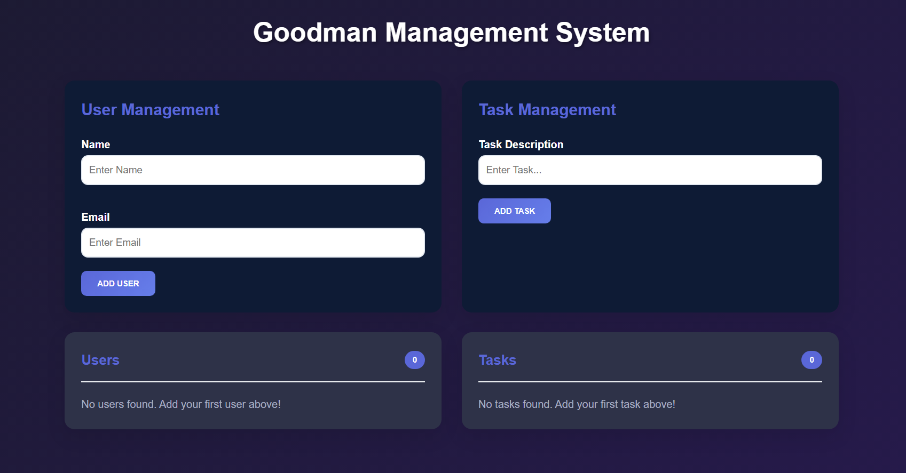
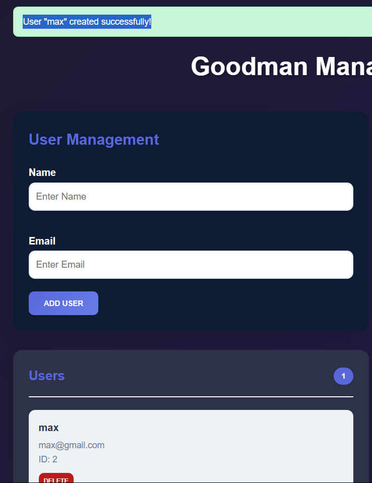
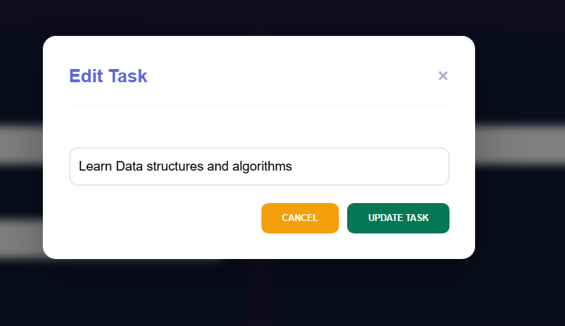
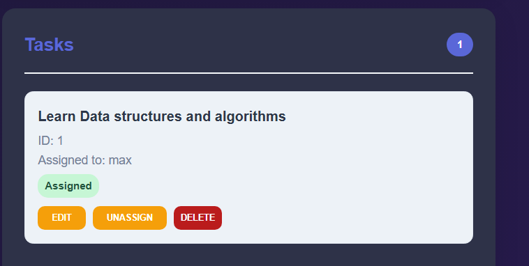
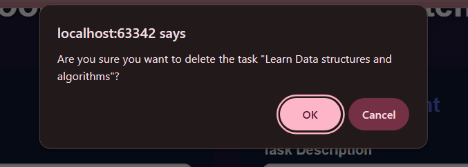
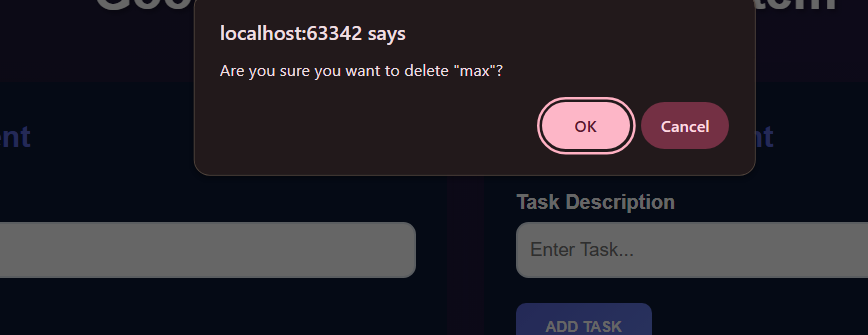

A sleek and user-friendly Task and User Management System built with TypeScript and Object-Oriented Programming (OOP).
Designed for efficiency and simplicity, Goodman lets you manage users and assign tasks seamlessly through a modern web
interface.

        **Homepage UI**

        **Creating  a user**

        **creating Task**

        **Editing Task**

        **Assigning a Task to user**

        **Assigned user**

        **Deleting Task**

        **Deleting a user**
